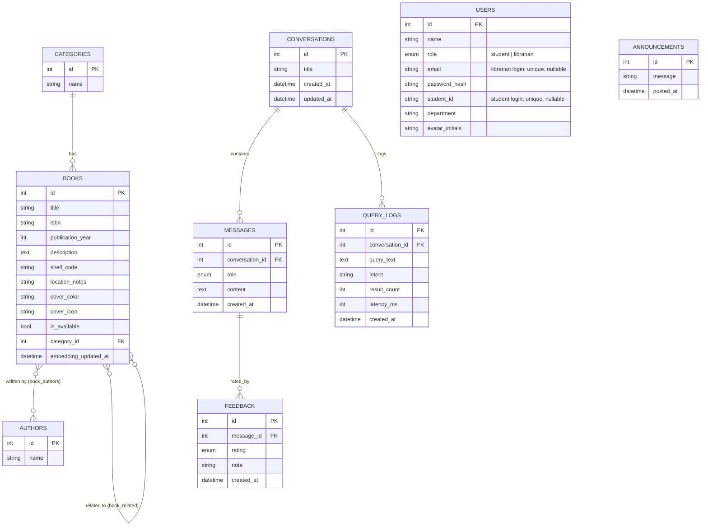

# ASKMQL Entity-Relationship Diagram

## Notes

- `book_authors` and `book_related` are pure join tables (no
  attributes of their own), collapsed into the `}o--o{` relationships
  above rather than modeled as separate entities.
- `USERS` now carries login credentials (`role`, `email`/`student_id`,
  `password_hash` — see `docs/adr/0003-session-cookie-auth.md`) but
  still isn't linked to `CONVERSATIONS` — chat history stays anonymous
  for this milestone. Add a `user_id` FK on `conversations` if
  per-account history becomes a requirement.
- `embedding_updated_at` on `BOOKS` is unused until an embeddings
  provider is configured (see `docs/adr/0002-retrieval-adapter-seam.md`).
- Source of truth for the actual DDL is `backend/migrations/*.sql`;
  this file is documentation, not something migrations are generated
  from.
